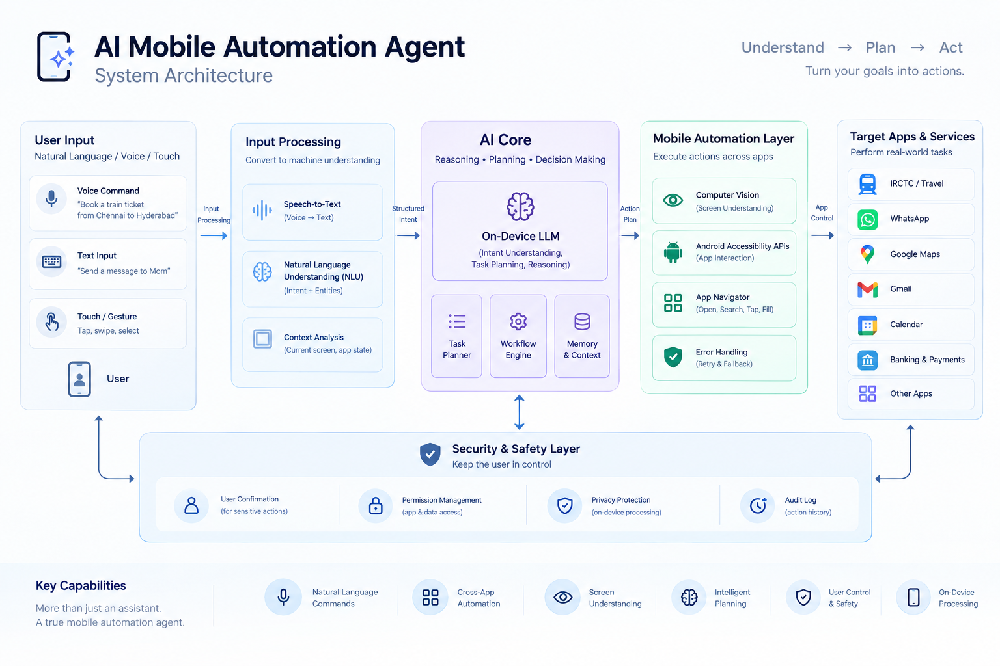
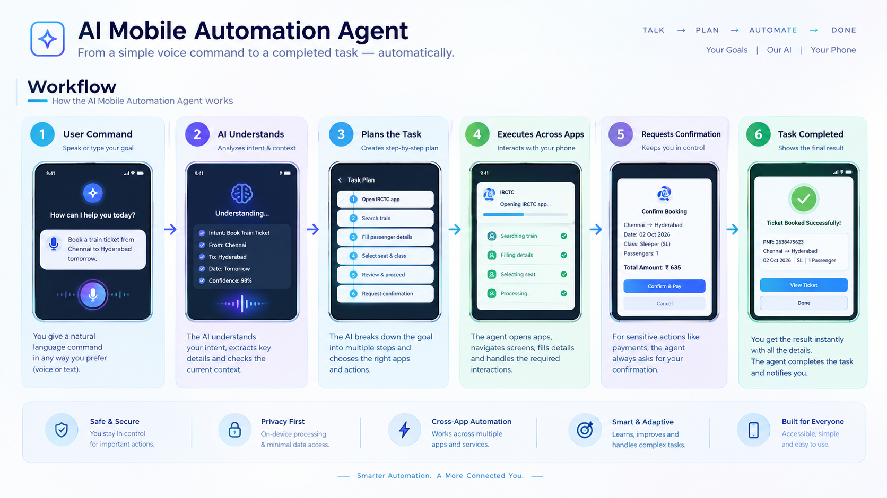

# AI Mobile Automation Agent

> Tell your phone what you want. Let AI do the work.

An intelligent on-device AI system that transforms smartphones into autonomous task executors. Instead of manually navigating multiple apps, users simply describe their goal, and the AI plans and executes the required actions while keeping the user in control for sensitive operations.

---

## Project Demo

The MVP is currently under development. The repository already includes the project architecture and workflow that demonstrate how the AI Mobile Automation Agent is designed to work.

- Architecture Diagram → `docs/architecture.png`
- Workflow Diagram → `docs/workflow.png`
- Interactive Prototype → Coming Soon
- Demo Video → Coming Soon

---

## The Problem

Everyday smartphone tasks require opening multiple apps, navigating several screens, and repeatedly entering information.

Examples:
- Booking tickets
- Sending messages
- Filling forms
- Setting reminders
- Searching across apps

This is time-consuming and creates accessibility challenges for many users.

---

## The Solution

AI Mobile Automation Agent understands natural language commands, analyzes the current screen, plans the required workflow, and interacts with different applications to complete the task.

Example:

> "Book me a train ticket from Chennai to Hyderabad tomorrow."

The agent:

1. Understands the request.
2. Opens the required app.
3. Fills the necessary information.
4. Verifies details.
5. Requests approval before payment.
6. Completes the task.

---

## Key Features

- Natural language commands
- Cross-app automation
- Screen understanding
- Intelligent workflow planning
- User confirmation for payments
- Privacy-focused design

---

## Example Workflows

- Train ticket booking
- WhatsApp messaging
- Alarm creation
- Google Maps navigation
- Form autofill
- Job application assistance

---

## Architecture

---

## Workflow

---

## Tech Stack

| Component | Technology |
|-----------|------------|
| AI Planning | On-device LLM |
| Voice Input | Speech-to-Text |
| Screen Understanding | Computer Vision |
| Mobile Control | Android Accessibility APIs |
| Workflow Engine | Intelligent Task Planner |

---

## Privacy & Safety

The system follows a Human-in-the-Loop approach.

- Sensitive actions require approval.
- Payments always require confirmation.
- Privacy-first architecture.

---

## Roadmap

- [x] Idea validation
- [ ] UI Prototype
- [ ] Architecture Design
- [ ] Workflow Simulation
- [ ] Android MVP
- [ ] Demo Video
- [ ] Hackathon Submission

---

## Future Vision

Move from tap-based smartphone interaction to goal-based AI automation where users describe outcomes instead of performing every step manually.

---

## License

MIT License
